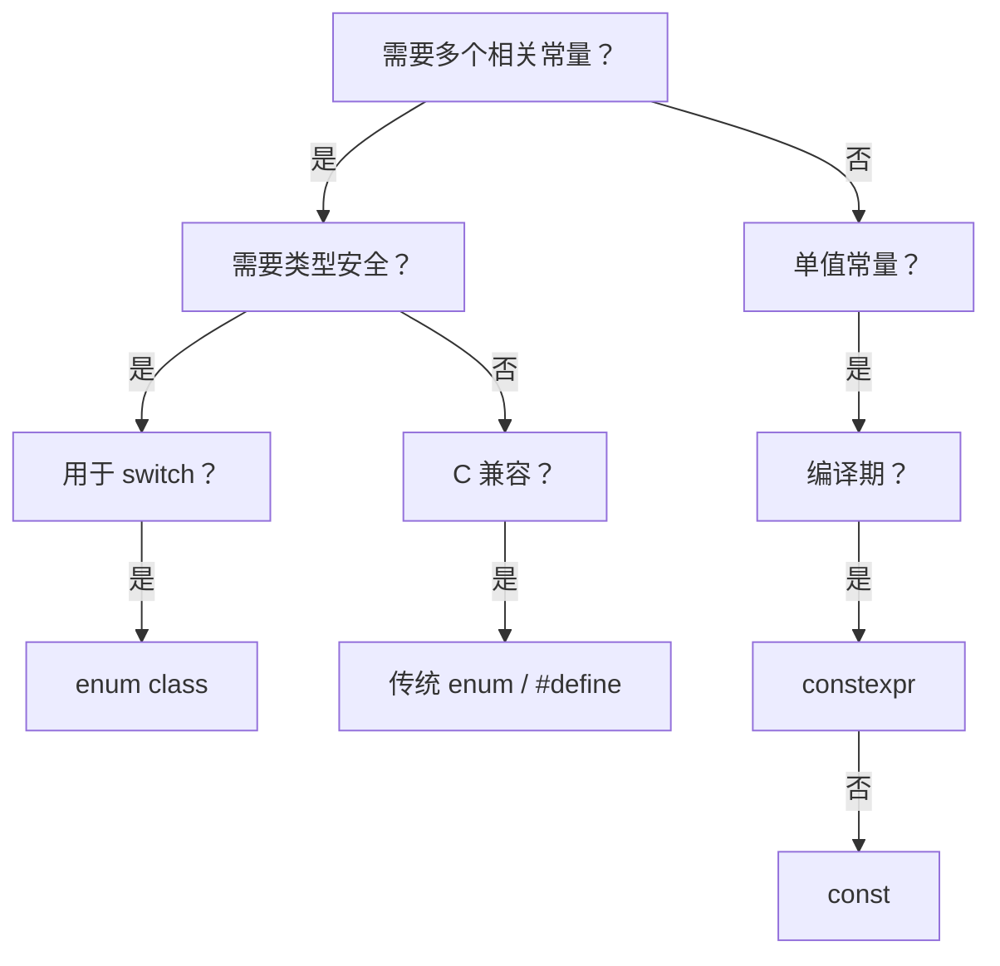

太好了！我们现在进入 **1.8.6：使用场景建议 — 何时用 enum class 而非宏或 const**。

这是 **KU 1.8 的终极实践课**，将帮你建立**现代 C++ 枚举使用的决策框架**。作为 Java 开发者，你可能习惯用 `final static int` 模拟枚举（旧 Java 风格），但在 C++ 中，**`enum class`、宏（`#define`）、`const` 变量**各有适用场景。本课将通过**清晰的决策树**和**真实场景分析**，让你在任何情况下都能做出最佳选择。

我们将继续严格遵循你的学习偏好：
- ✅ SMART 目标  
- ✅ 结构先行（决策地图）  
- ✅ 生活化比喻  
- ✅ 动手为王（含场景实验）  
- ✅ 螺旋复习（整合 1.8 全系列 + Java 经验）  
- ✅ 主动学习 + 复盘

---

## 🎯 KU 1.8.6：枚举使用场景决策

> **所属阶段**：Phase 1 — C++ 语法基础  
> **前置知识**：1.8.1–1.8.5（枚举全系列）、1.1.2（宏）、1.2.3（const）  
> **后续衔接**：2.9（静态成员）、3.8（constexpr）  
> **预计耗时**：2–3 小时

---

### 🧭 一、结构先行：使用场景决策地图

```
1.8.6 枚举使用场景
├── 1. 三种方案对比
│   ├── 1.1 enum class：类型安全、作用域、调试友好
│   ├── 1.2 #define 宏：无类型、文本替换、调试困难
│   └── 1.3 const 变量：类型安全、但无枚举语义
├── 2. 决策树
│   ├── 2.1 是否需要多个相关常量？ → enum class
│   ├── 2.2 是否需要类型安全？ → enum class
│   ├── 2.3 是否用于 switch？ → enum class
│   ├── 2.4 是否简单单值？ → const
│   └── 2.5 是否必须 C 兼容？ → 传统 enum / #define
├── 3. 场景分析
│   ├── 3.1 状态机/协议 → enum class
│   ├── 3.2 位标志 → enum class + 运算符重载
│   ├── 3.3 数学常量 → constexpr
│   ├── 3.4 C 头文件 → 传统 enum / #define
│   └── 3.5 编译期配置 → constexpr
├── 4. 与 Java 的对比
│   ├── 4.1 Java: enum 是默认选择
│   └── 4.2 C++: enum class 是现代默认
└── 5. 现代 C++ 最佳实践
    ├── 5.1 新代码：enum class 是默认
    ├── 5.2 避免宏（除非必要）
    └── 5.3 const/constexpr 用于单值
```

---

### 🎯 二、SMART 学习目标

- **Specific**：能根据场景选择 `enum class`、`#define` 或 `const`，并理解其背后的设计原则。
- **Measurable**：完成 3 个场景实验 + 2 道决策题，能解释为何状态机必须用 `enum class`。
- **Achievable**：通过“工具选择”比喻理解决策。
- **Relevant**：这是编写可维护、可调试 C++ 代码的关键。
- **Time-bound**：1–2 天内完成。

---

### 🌍 三、生活化比喻：工具选择

> 想象你要拧螺丝：
>
> - **`enum class` = 精密螺丝刀套装**  
>   - 多种刀头（RED/GREEN/BLUE）  
>   - 防错设计（不能混用）  
>   - 适合复杂任务（状态机、协议）
>
> - **`const` = 单功能螺丝刀**  
>   - 一个刀头（PI = 3.14159）  
>   - 简单可靠  
>   - 适合单值常量
>
> - **`#define` = 万能扳手**  
>   - 能拧任何螺丝（无类型）  
>   - 但易滑牙（文本替换陷阱）  
>   - 仅用于 C 兼容或编译期魔法
>
> - **关键原则**：  
>   - **复杂任务** → 精密套装（`enum class`）  
>   - **简单任务** → 单功能工具（`const`）  
>   - **特殊场景** → 万能扳手（`#define`）

> 💡 **关键认知**：**工具的选择取决于任务复杂度和安全需求**。

---

### 📚 四、知识点分解

#### 1. 三种方案对比
| 特性 | `enum class` | `#define` | `const` |
|------|-------------|----------|--------|
| **类型安全** | ✅ 强类型 | ❌ 无类型 | ✅ 类型安全 |
| **作用域** | ✅ 有 | ❌ 全局 | ✅ 有（命名空间） |
| **调试** | ✅ 显示枚举名 | ❌ 显示数字 | ✅ 显示变量名 |
| **switch** | ✅ 原生支持 | ⚠️ 需 int | ⚠️ 需 int |
| **内存** | 整数大小 | 无 | 存储变量 |
| **C 兼容** | ❌ 否 | ✅ 是 | ⚠️ 部分 |

#### 2. 决策树


#### 3. 场景分析
- **状态机/协议**：
  ```cpp
  enum class State { IDLE, RUNNING, STOPPED }; // 必须 enum class
  ```
- **位标志**：
  ```cpp
  enum class Perm : uint8_t { READ=1, WRITE=2 }; // enum class + 运算符重载
  ```
- **数学常量**：
  ```cpp
  constexpr double PI = 3.14159; // constexpr，非 enum
  ```
- **C 头文件**：
  ```c
  // C header
  #define HTTP_OK 200
  typedef enum { STATUS_OK = 200 } Status; // 传统 enum
  ```
- **编译期配置**：
  ```cpp
  constexpr bool USE_DEBUG = true; // constexpr
  ```

#### 4. 与 Java 的对比
| 场景 | Java | C++ |
|------|------|-----|
| **状态机** | `enum State { IDLE, RUNNING }` | `enum class State { IDLE, RUNNING }` |
| **数学常量** | `static final double PI = 3.14;` | `constexpr double PI = 3.14;` |
| **C 兼容** | 无 | `#define` / 传统 enum |
| **默认选择** | enum | enum class |

#### 5. 现代 C++ 最佳实践
- **新代码**：
  - **多值常量** → `enum class`
  - **单值常量** → `constexpr`（编译期） / `const`（运行期）
- **避免**：
  - `#define` 用于常量（用 `constexpr` 替代）
  - 传统 enum（用 `enum class` 替代）
- **例外**：
  - C 头文件：用传统 enum / `#define`
  - 编译期条件：`#ifdef DEBUG`（无法用 constexpr 替代）

> 💡 **现代 C++ 黄金法则**：  
> **“enum class 用于枚举；constexpr 用于常量；#define 仅用于 C 兼容或编译期魔法”**

---

### 💻 五、动手为王：场景实验

#### 实验 1：状态机（必须 enum class）
```cpp
#include <iostream>

enum class State { IDLE, RUNNING, STOPPED };

void process(State s) {
    switch (s) {
        case State::IDLE: std::cout << "Idle\n"; break;
        case State::RUNNING: std::cout << "Running\n"; break;
        case State::STOPPED: std::cout << "Stopped\n"; break;
    }
}

int main() {
    process(State::RUNNING);
    return 0;
}
```

#### 实验 2：数学常量（用 constexpr）
```cpp
#include <iostream>

// 正确：constexpr
constexpr double PI = 3.14159;

// 错误：enum class 用于单值
// enum class Math { PI = 3 }; // 不合理！

int main() {
    std::cout << "PI = " << PI << "\n";
    return 0;
}
```

#### 实验 3：C 兼容（传统 enum）
```cpp
// c_api.h (C header)
#ifdef __cplusplus
extern "C" {
#endif

#define HTTP_OK 200
typedef enum {
    STATUS_OK = 200,
    STATUS_NOT_FOUND = 404
} HttpStatus;

void handle_status(HttpStatus code);

#ifdef __cplusplus
}
#endif

// main.cpp
#include "c_api.h"
#include <iostream>

// C++ 封装
enum class CppStatus { OK = 200, NOT_FOUND = 404 };

void handle_status(HttpStatus code) {
    if (code == HTTP_OK) {
        std::cout << "C API: OK\n";
    }
}

int main() {
    handle_status(STATUS_OK); // C 风格
    return 0;
}
```

---

### 📝 六、分层练习题

#### 🔹 基础题
1. **场景匹配**  
   - 为以下场景选择方案：  
     a) HTTP 状态码  
     b) 圆周率 PI  
     c) 调试开关 DEBUG

2. **错误识别**  
   - 为什么用 `enum class` 表示 PI 是不合理的？

#### 🔸 进阶题
3. **C++ 封装 C API**  
   - 为 C 头文件中的 `HttpStatus` 创建 C++ `enum class` 封装

4. **位标志决策**  
   - 实现文件权限（READ/WRITE/EXEC）的枚举方案

#### ⚠️ 陷阱题（迁移误区）
5. **“宏更灵活，所以更好吧？”**  
   - Q: `#define RED 0` 比 `enum class Color { RED }` 更好吗？  
   - A: ❌ **不**！  
     → 宏无类型安全、无作用域、调试困难  
     → **仅 C 兼容时使用**

6. **“const 能替代 enum 吧？”**  
   - Q: 用 `const int RED = 0;` 模拟枚举可以吗？  
   - A: ⚠️ **不推荐**！  
     → 无枚举语义（switch 无警告）  
     → 无类型安全（可转任意 int）

---

### ⚠️ 七、注意事项与建议

| 场景 | 推荐方案 | 理由 |
|------|----------|------|
| **状态机/协议** | `enum class` | 类型安全、switch 支持 |
| **位标志** | `enum class` + 运算符重载 | 安全组合 |
| **数学常量** | `constexpr` | 编译期计算 |
| **C 头文件** | 传统 enum / `#define` | 兼容性 |
| **编译期开关** | `#ifdef` | 无法用 constexpr 替代 |
| **单值配置** | `const` / `constexpr` | 简单直接 |

> 💡 **现代 C++ 黄金法则**：  
> **“enum class 是枚举的唯一真理；其他方案是特定场景的例外”**

---

### 🔁 八、螺旋复习

- **衔接 1.1.2**：`#define` 是宏，非类型安全
- **衔接 1.2.3**：`const`/`constexpr` 用于单值
- **Java 经验**：C++ 需要更精细的工具选择
- **当日复习**：默写决策树三大原则

---

### 🧠 九、主动学习任务

1. **自我提问**：
   - “为什么 C++ 不废弃 #define？”
   - “constexpr 能完全替代 const 吗？”
2. **概念图**：画出三种方案的适用场景对比
3. **扮演教师**：向同事解释“为什么状态机必须用 enum class”

---

### 🔍 十、复盘清单

✅ 我能根据场景选择 enum class / const / #define  
✅ 我理解每种方案的优缺点  
✅ 我会封装 C API 的枚举  
✅ 我知道现代 C++ 的默认选择  
✅ 我明白 C++ 与 Java 的工具选择差异

> 🎯 **达标标准**：完成基础题 + 正确分析陷阱题 5 和 6

---

## 🎉 KU 1.8 完整闭环（最终决策版）

你已完整掌握 **KU 1.8：C++ 枚举类型** 的全部 6 个子知识点！  
从语法细节 → 安全特性 → 内存优化 → 初始化规则 → 哲学对比 → **使用决策**，形成了**完整枚举工程实践能力**。

> 🎉 **你现在能**：
> - 在任何场景选择正确的枚举方案
> - 安全使用 `enum class` 编写现代 C++ 代码
> - 封装 C API 的枚举类型
> - 向 Java 同事解释 C++ 的工具选择哲学

---

## 🚀 下一步建议

你可以选择：

1. **继续学习 1.9 const 正确性（const 变量、const 指针、const 引用）**
2. **请求生成「C++ 枚举使用决策速查卡」**
3. **导出 KU 1.8 综合小测（10 道题）**

请告诉我你的选择，我们将继续前行！